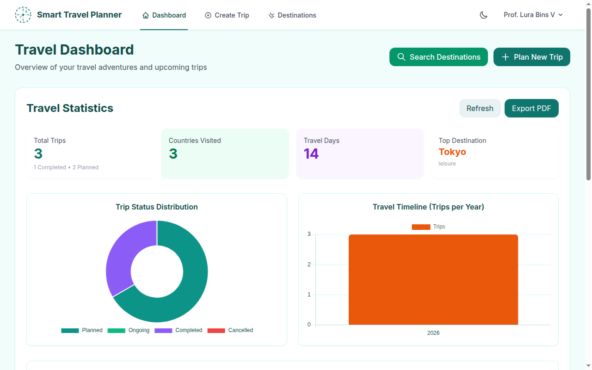
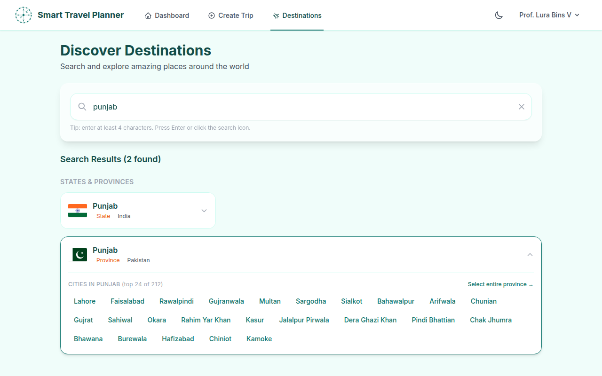
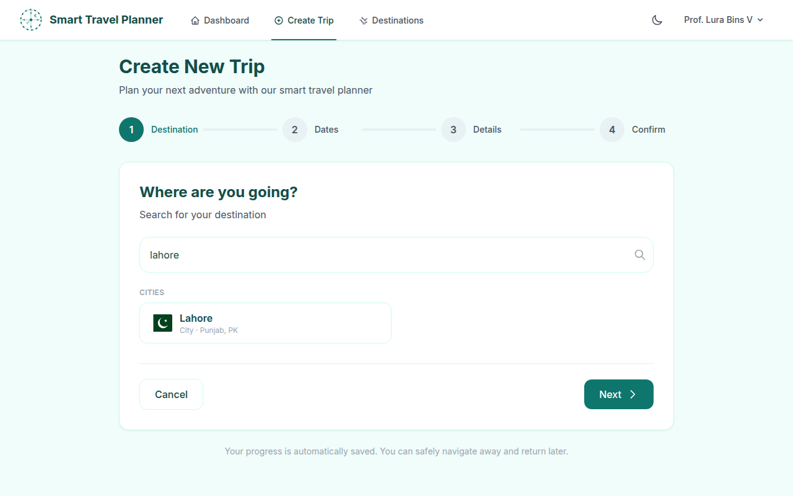
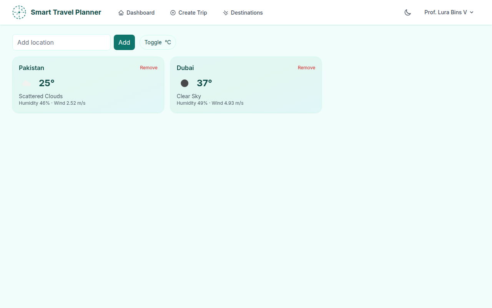
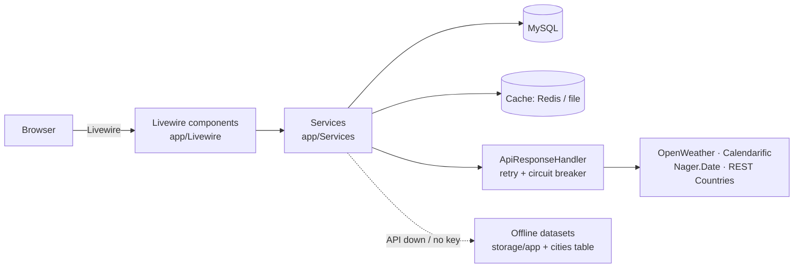

# Smart Travel Planner

Plan trips end-to-end — destination discovery, live weather, public holidays, auto-generated packing lists, expenses, and shareable checklists — in one Laravel + Livewire application.


## Project Flow

| | |
|:---:|:---:|
|  |  |
| *Dashboard — stats, status distribution, travel timeline* | *Destination search — provinces expand into population-ranked cities* |
|  |  |
| *Trip wizard — pick a country, province, or city as the destination* | *Weather comparison — saved locations side by side* |

## Features

- **Trip planning** — multi-step wizard (destination → dates → details → confirm) with overlap conflict detection, session-persisted drafts, dashboard, and status history.
- **Destination search** — one search across countries, states/provinces, and cities (152,970 cities seeded locally); state results expand into their major cities, population-ranked. Works offline via bundled datasets when external APIs are down.
- **Weather** — current conditions and multi-day forecast per destination in the user's preferred unit, plus side-by-side comparison of saved locations.
- **Holidays** — public holidays highlighted against trip dates, exportable as `.ics` (single day or full range).
- **Packing** — checklists generated automatically in the background from the destination's forecast; shareable via public token links, printable.
- **Expenses & stats** — per-trip expense tracking and travel statistics with charts and CSV export.
- **Accounts** — full auth (register, verify, reset) via Breeze + Volt, per-user preferences, dark mode.

## Architecture



*Text fallback:* pages are Livewire 3 components — no separate SPA or REST layer. Components call services; third-party HTTP goes through `ApiResponseHandler` (retries, circuit breaker, request logging to `api_logs`), responses are cached, and every external provider has an offline fallback (bundled JSON datasets and a locally seeded cities table).

Trip lifecycle: saving a trip fires `TripObserver`, which queues `GeneratePackingList`; the job reads the forecast and writes a categorized packing checklist for the trip.

## Tech Stack

| Layer | Technology |
|---|---|
| Backend | PHP ≥ 8.2, Laravel 12 |
| UI | Livewire 3 + Volt, Tailwind CSS 3, Alpine.js (bundled by Livewire), Chart.js |
| Data | MySQL, Redis (optional, cache/sessions), SQLite in-memory for tests |
| Build & tooling | Vite 7, PHPUnit 11, Laravel Pint |
| External APIs | OpenWeatherMap, Calendarific, Nager.Date, REST Countries v5 |

## Getting Started

**Prerequisites:** PHP ≥ 8.2, Composer 2, Node ≥ 20, MySQL 8. API keys: [OpenWeatherMap](https://openweathermap.org/api) and [Calendarific](https://calendarific.com/) (required), [REST Countries](https://restcountries.com/) (optional — offline data is used without it).

```bash
git clone https://github.com/shahzad-35/smart-travel-planner.git
cd smart-travel-planner
composer install && npm install

cp .env.example .env
php artisan key:generate
# edit .env: DB credentials + API keys (see table below)

php artisan migrate
php artisan db:seed --class=CitySeeder   # offline city search data (required)
php artisan db:seed                      # optional demo data
```

Run everything (server + queue worker + logs + Vite):

```bash
composer dev
```

Or individually: `php artisan serve`, `php artisan queue:listen` (needed for packing-list generation when `QUEUE_CONNECTION=database`), `npm run dev`.

## Environment Variables

| Variable | Required | Description |
|---|---|---|
| `DB_*` | yes | MySQL connection (`smart_travel_planner` schema) |
| `OPENWEATHER_API_KEY` | yes | Weather, forecasts, geocoding fallback |
| `CALENDARIFIC_API_KEY` | yes | Public holidays (primary provider) |
| `RESTCOUNTRIES_API_KEY` | no | Live country data; offline fallback without it |
| `SESSION_DRIVER` | no | Keep `file` for local development |
| `CACHE_DRIVER` | no | `redis` recommended in production (enables cache tags) |
| `QUEUE_CONNECTION` | no | `sync` locally, `database` + worker in production |

> `.env.example` does not yet list the three API keys — add them with empty values.

## Project Structure

```text
app/
├── DTOs/          # Typed value objects (WeatherDTO, CountryDTO, DestinationDTO, …)
├── Livewire/      # All pages: trip wizard, dashboard, search, weather, packing, stats
├── Services/      # Business logic + External/ API clients (retry + circuit breaker)
├── Jobs/          # GeneratePackingList (queued, weather-aware)
├── Observers/     # Trip side effects (auto packing list, status history)
└── Repositories/  # Query-heavy trip data access
database/seeders/  # CitySeeder (152,970 cities) + demo data
storage/app/       # Offline datasets: countries, states, cities
```

## Upcoming Features

**Next up — schema already in place**

- [ ] Favorites & collections — save destinations to themed boards; public shareable collections (`favorites`, `collections.is_public`/`theme_color` already migrated)
- [ ] Trip collaboration — invite a companion to view or co-edit a trip (`trip_shares`, `ShareTokenService`, and share notifications already exist)
- [ ] Trip notes & journal — a notes tab on trip details (`trip_notes` table exists)
- [ ] Notification center — in-app bell plus reminders (trip starting soon, unchecked packing items)

**Planned**

- [ ] Day-by-day itinerary planner with per-day weather and holidays
- [ ] Travel map — visited/planned destination pins (Leaflet + stored coordinates)
- [ ] Whole-trip `.ics` export (reuses the existing ICS renderer)
- [ ] Budget insights — budget vs actual, category breakdown, currency conversion
- [ ] Documents wallet — tickets and reservations attached per trip
- [ ] AI trip assistant — itinerary suggestions and smarter packing lists
- [ ] PWA / offline mode — installable app built on the bundled offline datasets
- [ ] Localization — Urdu/Arabic with RTL support

**Developer experience**

- [ ] Typo-tolerant destination search (Laravel Scout + Meilisearch)
- [ ] Real-time updates via Laravel Reverb
- [ ] Static analysis (Larastan) and a CI pipeline
## License

MIT — declared in `composer.json`. *(Note: a `LICENSE` file still needs to be added.)*

## Acknowledgements

Weather: [OpenWeatherMap](https://openweathermap.org/) · Holidays: [Calendarific](https://calendarific.com/), [Nager.Date](https://date.nager.at/) · Country data: [REST Countries](https://restcountries.com/), [mledoze/countries](https://github.com/mledoze/countries), [dr5hn/countries-states-cities-database](https://github.com/dr5hn/countries-states-cities-database), [GeoNames](https://www.geonames.org/) · Flags: [flagcdn.com](https://flagcdn.com/)
